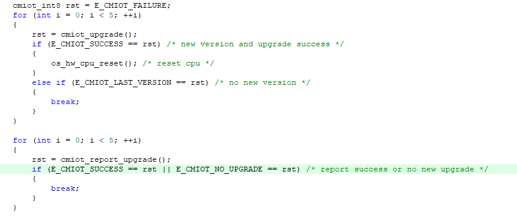

# 简介

远程升级（Firmware Over The Air）可通过无线网络实现固件升级。OneOS的OTA为差分升级，采用此方式可极大降低升级包的大小。OneOS OTA组件分两部分：BootLoader和App，BootLoader实现固件还原功能、升级功能，App部分完成更新检测、固件下载、版本校验。


**下载协议所有板子目前都可支持，列举部分板子差分算法的支持情况**（RAM > 200k，可以考虑使用Wosun；RAM > 512k，可以考虑使用Wosun high）：

**注1：如果使用串口通信，buffer推荐设置成512或更大，以免下载升级包出错**

STM32F091：支持LUSUN。（256+32）

STM32F103：支持LUSUN。（512+64） 

STM32F407：支持LUSUN。（1024+128）

STM32F769：支持LUSUN，WOSUN。（2048+512） 

STM32L475：支持LUSUN，WOSUN。（512+128） 

STM32G071：支持LUSUN。（128+36）

HC32L196：支持LUSUN。（256+32）


# 配置指南

**menuconfig配置：**

1.由于要使用BootLoader，需要将BootLoader的开关打开。如下：

```
(Top) → Boot Config
                                         OneOS Configuration
[*] Enable OneOS bootloader
```

2.选择合适的联网方式

**注2：使用串口收发数据时，buffer推荐设置为512或更大;如果接收数据丢失，查看RX是否配置为DMA接收模式**

3.OTA相关信息配置

按需要更更改的地址为：1、下载的方式，2、差分的算法，3、平台相关的值。
下载的方式目前支持HTTP和COAP，差分的算法目前支持LUSUN、WOSUN LOW、WOSUN HIGH，BootLoader和App需要保持算法一致。App对应这两个的配置选项如下。

```
(Top) → Components→ Network→ OTA→ Fota by CMIOT
                                         OneOS Configuration
[*] Enable fota by cmiot
        The supported network protocol (Http)  --->
        The supported algorithm (Lusun)  --->
```

如果使用Wosun 差分算法，还需要配置如下两项：

```
(0x8020000) App part addr from fal's OS_APP_PART_ADDR
(0x20000) Download part size from fal's OS_DL_PART_SIZE
```

分别把OS_APP_PART_ADDR和OS_DL_PART_SIZE算出来的值填入即可，这是制作差分包时，平台需要的信息。

4. 与平台相关配置：

```
(cmiot_cd) Oem
(F103RE) Model
(1593394730) Product id
(e7f48e3ea6c3417d82edfe66b1305ac8) Product secret
(box)   Device type
(STM32F1) Platform
(5.0)   Firmware version    
```

**注3：须保持与OTA平台侧项目信息一致。**

**注4： Firmware version  是制作出软件包的版本，改变此值后在KEIL里编译会生成相应版本的软件包，之后即可在OTA平台上传制作差分包**


**工程构建：**

1、APP烧录的位置和大小，跟APP分区一致，不能随意更改，不然会跳转失败，可以参照下面注7。

**注5：不同的联网方式会改变app大小，需要根据使用场景调整app及bootloader分区大小**

2、打包命令可以加到Keil软件里，也可以自己手动在scons或cmd命令行打包。命令为：

压缩软件支持：WinRAR.exe、7z.exe

```
只生成axf文件的打包命令：..\..\components\net\ota\cmiot\cmiot_axf.bat fromelf程序路径 压缩软件路径 oneos_config.h axf文件路径
已生成bin文件的打包命令：..\..\components\net\ota\cmiot\cmiot_bin.bat 压缩软件路径 oneos_config.h bin文件路径

例如：
只生成axf文件：..\..\components\net\ota\cmiot\cmiot_axf.bat "D:\Keil_v5\ARM\ARMCC\bin\fromelf.exe" "C:\Program Files\WinRAR\WinRAR.exe" oneos_config.h build\keil\Obj\oneos.axf
已生成bin文件：..\..\components\net\ota\cmiot\cmiot_bin.bat "C:\Program Files\WinRAR\WinRAR.exe" oneos_config.h ..\..\out\stm32l475-atk-pandora\oneos.bin
```

**注6：WinRAR.exe和fromelf.exe是绝对路径，需要根据个人电脑相应路径进行修改**

**注7：App的烧录地址要跟分区表匹配，才能跳转成功，以ARMCC的链接文件link.sct为例，GCC的链接文件为link.ids，IAR的链接文件为link.icf。**


**注8：F0系列产品需要注意KEIL配置RAM根据以下代码修改**


**OTA云平台制作差分包**

1.平台建项目的时候注意选精简版，我们的板子只支持这个。OTA类型选择精简版。

2.差分对比块大小和驱动一样，配置为块大小。


3.如果使用WOSUN，在OTA平台制作差分包时需要设置设备内存，设置为(RAM总大小 - 10)


# 示例

1、包含头文件

```
#include <cmiot_user.h>
```

2、添加上报升级结果和升级更新的代码



### API使用说明手册

[OTA API使用说明手册](cmiot/doc/ota_api.md)


# 注意事项

详细见各个分项下的注意事项。