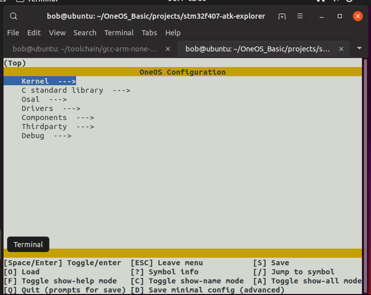
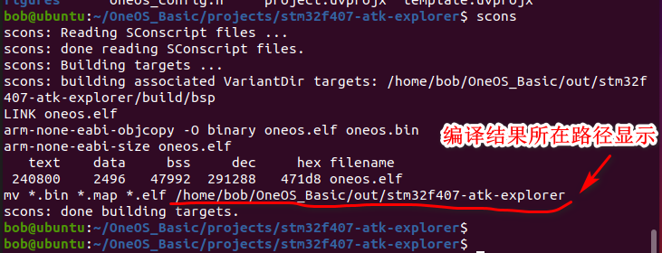
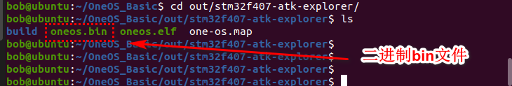

# 			OneOS-Linux环境开发指南

## 概述

本文档将以ubuntu命令行环境为示例说明linux下如何搭建OneOS的开发环境，其他linux变体操作系统的操作基本思路是一样的，只需要适当调整安装软件的方法即可。

## 1 环境准备

### 1.1 安装scons环境

`sudo apt-get install scons`

通过下面命令查看scons版本信息，确认安装是否能正常启动

`scons -v`

### 1.2 下载交叉编译工具链

由于不同的编译器版本，可能存在一些头文件适配的问题。这里建议使用如下已经适配验证过的工具链。直接使用如下命令下载（针对64位linux平台）：

`wget –c https://developer.arm.com/-/media/Files/downloads/gnu-rm/6-2017q2/gcc-arm-none-eabi-6-2017-q2-update-linux.tar.bz2?revision=2cc92fb5-3e0e-402d-9197-bdfc8224d8a5?product=GNU%20Arm%20Embedded%20Toolchain,64-bit,,Linux,6-2017-q2-update -O gcc-arm-none-eabi-6-2017q2.tar.bz2`

如果网络不好，下载失败，可以在同样的下载路径下重新输入上述命令，会自动进行断点续传下载。

下载完成后，解压工具链：

`tar -xf gcc-arm-none-eabi-6-2017q2.tar.bz2`

获取编译工具链的路径（即指向解压的工具链的bin子文件夹的绝对路径）：

`cd gcc-arm-none-eabi-6-2017-q2-update/bin/`

`pwd`

将上面pwd的输出路径拷贝。这就是我们编译工具链的路径，下面配置源码中对工具链的索引路径会用到。举例我这里的实验路径为：

/home/bob/toolchain/gcc-arm-none-eabi-6-2017-q2-update/bin

### 1.3 配置工具链环境变量

为了让OneOS编译脚本找到交叉编译工具链，需要配置一个环境变量“OS_EXEC_PATH”. 将上面安装的工具链路径赋值给它。

1) 修改.bashrc文件，输入命令：

`vim ~/.bashrc`

在文件末尾添加一行，定义OS_EXEC_PATH环境变量如下所示：（注意“=”号右边的内容需要替换成用户自己的交叉编译工具路径）：

`export OS_EXEC_PATH="/home/bob/toolchain/gcc-arm-none-eabi-6-2017-q2-update/bin"`

2) 修改.profile文件，输入命令：

`vim ~/.profile`

在文件末尾添加一行，定义OS_EXEC_PATH环境变量如下所示：（注意“=”号右边的内容需要替换成用户自己的交叉编译工具路径）：

`export OS_EXEC_PATH="/home/bob/toolchain/gcc-arm-none-eabi-6-2017-q2-update/bin"`

修改完毕后，需要退出shell命令行，重新登录让环境变量生效。重新登录后在命令行中输入命令：

`echo $OS_EXEC_PATH`

如果返回编译工具所在路径，则说明环境变量设置成功，接下来就可以编译源码了。

（需要说明的是，以上方法针对的是bash shell，绝大部分linux操作系统默认都采用的bash。用户可以在命令行输入“ echo $0 ” 命令，返回”bash” 或 ”-bash”则说明用户环境是bash shell，否则用户需要根据自己的shell类型，查看相应的环境变量配置方法。）

## 2 进行系统配置

进入源码中要使用的工程目录（例如projects/stm32f429-atk-apollo）下直接输入命令：

`scons --menuconfig`

即可弹出操作系统配置菜单。用户根据自己的需要配置即可。操作方法与linux传统的menuconfig是一致的。如下图：

## 3 编译

在想要编译的工程目录（例如projects/stm32f429-atk-apollo）下直接输入命令：

`scons`

即可开始编译流程。生成镜像默认位于源码顶层目录out目录中，也会在编译结束时打印路径，如下图所示：

编译产物中，二进制结果默认为“oneos.bin”。可直接用于烧写。

